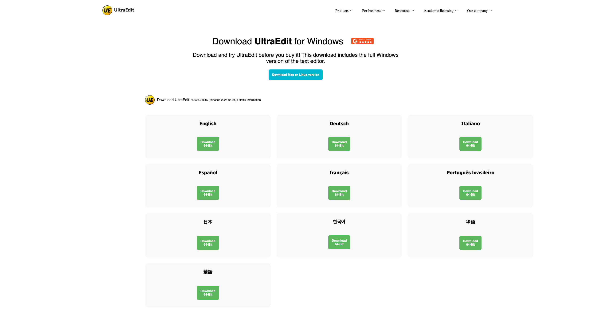

UltraEdit Website Clone
This is a fully responsive front-end clone of the UltraEdit homepage, built using only HTML and CSS. It replicates the design and layout of the original site for educational and practice purposes.

🧠 Project Purpose
This project was created to:

Practice real-world web layout techniques

Strengthen skills in responsive design

Understand structure and styling without frameworks

Learn how to closely match an existing website visually

✨ Features
✅ Pixel-perfect clone of the UltraEdit homepage

✅ Pure HTML5 & CSS3 (no JS or frameworks)

✅ Responsive design for mobile, tablet, and desktop

✅ Clean, modular CSS using Flexbox and Grid

✅ Organized file and folder structure

🗂️ Project Structure
bash
Copy
Edit
ultra-edit-website-clone/
│
├── index.html            # Main HTML file
├── style.css             # Main CSS stylesheet
├── /assets               # Static files (images, icons, etc.)
│   └── /images
├── /fonts                # (Optional) Custom fonts if used
└── README.md             # Project documentation
🚀 Getting Started
Clone the Repository
bash
Copy
Edit
git clone https://github.com/sagar-katoch/ultra-edit-website-clone-using-html-and-css.git
cd ultra-edit-website-clone-using-html-and-css
Open in Browser
Just open index.html with your preferred browser:

bash
Copy
Edit
open index.html
Or use VS Code’s Live Server extension for auto-refresh.

🧰 Built With
HTML5 – Semantic and accessible structure

CSS3 – Layout, styling, and responsiveness

Flexbox & CSS Grid – For modern, flexible design

Media Queries – To adapt to various screen sizes

📄 License
This project is for educational and practice purposes only. It is not affiliated with or endorsed by UltraEdit or its developers.

